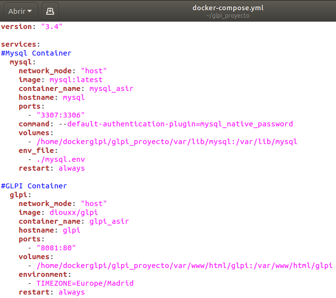

# IMPLEMENTACIÓN Y CONFIGURACIÓN DE GLPI, ANSIBLE Y AWS

***
## ÍNDICE

1. **OBJETIVO ALCANZADO VS ALCANZABLE**
2. **1º BLOQUE - GLPI Y DOCKER**
   * docker-compose.yml
   * Plugin Fusioninventory
   * Problemas que surgieron
3. **2º BLOQUE - ANSIBLE**
   * Configuración
   * Concepto de Playbook
   * Ejemplo de Playbook
4. **3º BLOQUE - GLPI Y AMAZON WEB SERVICES (AWS)**
   * Configuración principal de la instancia
						
***
			
## OBJETIVO ALCANZADO VS ALCANZABLE

* **Objetivo alcanzado:** Implementación de un mismo software usando tecnologías alternativas (Contenedores e Instancia en la nube).

* **Objetivo alcanzable:** Centralización de ambas implementaciones de una forma alternativa usando **Lightsail** de Amazon (permite el manejo de docker de forma mucho más sencilla) y a la vez hacer una configuración básica de varias instancias usando Ansible.
						
***

## 1º BLOQUE - GLPI Y DOCKER

> **GLPI (acrónimo: en francés, “Gestionnaire Libre de Parc Informatique”)** es un software que nos permite gestionar toda la infraestructura o el área tecnológica de una organización, la principal funcionalidad de este software es facilitar al administrador la gestión de todos los elementos que componen la red.

***



***
	
### Plugin Fusioninventory

> **Fusioninventory** es un software libre que permite recopilar información de inventario de los elementos conectados a una red determinada, además también permite realizar tareas como wakeonlan pero en esta ocasión nos centraremos en el inventario.

?> :information_source: En el proyecto se ha usado el plugin y el agente de fusioninventory.
						
***

### Problemas que surgieron

* Errores a la hora de realizar el inventario desde GLPI como tarea programada.

* Automatizar tareas como ejecución de scripts y configuraciones.

* Aplicar una misma configuración a múltiples nodos en la red.

***

## 2º BLOQUE - ANSIBLE

> **Ansible** es un software que automatiza el aprovisonamiento de software, la gestión de configuraciones y el despliegue de aplicaciones.

?> :information_source: Este software nos ayudará a apaliar los problemas anteriores.

***

### Configuración

> Para establecer la configuración básica tenemos que modificar dos ficheros:

* ansible.cfg (/etc/ansible/ansible.cfg) donde se establecen configuraciones de conexión, tiempo de espera para la conexión, etc...

* hosts (/etc/ansible/hosts) donde se indican los hosts que serán afectados y existen dos opciones, o se especifican un grupo de hosts (un conjunto que se referencia mediante un nombre) o no se especifica nada.

***

### Concepto de Playbook
						
> Un **Playbook** es un fichero yaml que es capaz de implementar diversas configuraciones a múltiples nodos de forma paralela y secuencial.

?> :information_source: Antes debemos asegurarnos que el servidor Ansible que lanza la configuración y los nodos pueden iniciar una conexión SSH.

***

### Ejemplo de Playbook

```playbook_example.yml
---
hosts: all 
remote_user: root 
tasks: 
- name: Asegurarse que apache está en la última versión 
  apt: name=apache2 state=latest 
- name: Asegurarse que apache está activo 
  service: name=apache2 state=started enabled=yes 
```
**Sintaxis básica de ejecución**

```bash
ansible-playbook -i hosts -u tarde -k entorno-cfg.yml
```

***

## 3º BLOQUE - GLPI Y AMAZON WEB SERVICES (AWS)
> AWS es la plataforma en la nube líder que ofrece muchas posibilidades y de entre todas ellas he usado "Amazon Elastic Compute Cloud" o EC2 (Instancias).

?> :information_source: Gracias a ella he creado una instancia desde la que implantar GLPI de una forma alternativa a como lo hice con Docker.

***

### Configuración principal de instancia

1. Generar claves SSH para la conexión.
2. Asignación de IP estática (Elastic IPs).
3. Alquiler de dominio y alojamiento web.
4. Instalación de certificados SSL (Certbot).
5. Implementación de GLPI.
6. Configuración reglas de entrada al entorno web (Inbound).
