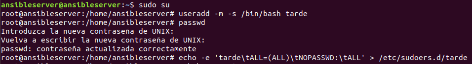

# ¿Qué es Ansible?

> **Ansible** es un software que automatiza el aprovisionamiento de software, la gestión de configuraciones y el despliegue de aplicaciones.
Para comprenderlo más fácilmente, hablando de forma más coloquial, diremos que Ansible es un software con el que podemos instalar distintos programas y aplicar diversas configuraciones a un grupo de equipos remotos principalmente para no tener que ir equipo a equipo realizando los cambios manualmente.

## Instalación y configuración de Ansible

> Ansible, usa SSH para la conexión con los equipos remotos reconociéndose ambos mediante la compartición de sus claves públicas. Normalmente Ansible se ejecuta usando un usuario específico en los equipos remotos que es el que se encarga de realizar las tareas programadas pero en este caso dado que sé con seguridad que las credenciales del usuario en todos los equipos es la misma, usaré esa ventaja para automatizar ciertos pasos que supondrían un tiempo que no tengo para esta ocasión.

### Creación de usuario

> El primer paso será crear un usuario con idénticas credenciales que el usuario de clase y a su vez lo hacemos usuario root agregándolo a sudoers.



### Instalación de Ansible

> Para instalar Ansible en Ubuntu debemos de ejecutar los siguientes comandos

```bash
sudo apt-get install software-properties-common
sudo apt-add-repository ppa:ansible/ansible
sudo apt-get update
sudo apt-get install ansible
```

### Configuración de Ansible

> Para la configuración modificaremos dos archivos.

#### ansible.cfg

```/etc/ansible/ansible.cfg
[defaults]
host_key_checking = false
remote_tmp = /tmp/.ansible-${USER}/tmp
...
```

>> Esta primera línea deshabilita la confirmación de aceptación de clave si se produce algún cambio en los hosts conocidos (known_hosts) y se debe recolectar la nueva clave de dicho host.

>> Con la segunda línea evitamos que los equipos remotos queden bloqueados al no especificar el directorio temporal en el que se ejecutarán las tareas automáticas.

***

#### hosts

> En este fichero indicaremos los hosts de destino de las tareas.

```/etc/ansible/hosts
[casa]
192.168.1.144
192.168.1.146
...
```

?> :information_source: En caso de que queramos implementar una misma configuración a un grupo de equipos remotos en el playbook haríamos referencia al nombre del grupo que en este caso sería el grupo **"casa"**.

***

## ¿Qué es un Playbook?

> Un **"Playbook"** es un fichero escrito en YAML que contiene un conjunto de tareas a ejecutar en los equipos remotos **(nodos)** de forma automática, además estas tareas serán ejecutadas de forma paralela en todos los nodos secuencialmente.

### entorno_cfg.yml paso a paso

```entorno_cfg.yml
---
- hosts: all

  become: true

  gather_facts: no

...
```

> La traducción de este fragmento nos dice que se implementará en todos los hosts definidos en el archivo hosts, que nos convertiremos al usuario remoto (become: yes).

***

```entorno_cfg.yml
...

# Instalación de Python #

  pre_tasks:

  - name: 'install python'
    become_user: root
    raw: 'sudo apt-get -y install python'

...
```

> Creamos una tarea que se ejecutará siempre antes que el resto y que consiste en instalar python en caso de no estarlo.

***

```entorno_cfg.yml
...

# Compartir clave pública del usuario tarde #

  tasks:
    - authorized_key:
        user: tarde
        state: present
        key: "{{ lookup('file', '/home/tarde/.ssh/id_rsa.pub') }}"

...
```

> Compartimos la clave pública del servidor Ansible con los nodos


***

```entorno_cfg.yml
...

# Añadir usuario a sudoers #

    - name: "Añade al usuario tarde al grupo sudoers"
      copy:
          dest: "/etc/sudoers.d/tarde"
          content: "tarde ALL=(ALL) NOPASSWD: ALL"

...
```

> Añadimos al usuario tarde de los nodos al grupo sudoers


***

```entorno_cfg.yml
...

# Generamos un par de claves en los hosts remotos #

    - name: "Creación de par de claves"
      user:
        name: tarde
        generate_ssh_key: yes
        ssh_key_bits: 2048
        ssh_key_file: .ssh/id_rsa

...
```

> Generamos un par de claves en los hosts remotos


***

```entorno_cfg.yml
...

# Instalación sshpass #

    - name: "Instalación de sshpass"
      become_user: root
      shell: apt-get install sshpass

...
```

> Instalamos sshpass

?> :information_source: **sshpass** permite iniciar una conexión ssh pasando como parámetro de entrada la contraseña para evitar la petición de forma interactiva.


***

```entorno_cfg.yml
...

# Instalación wget #

    - name: "Instalación de wget"
      become_user: root
      shell: apt-get install wget

...
```

> Instalamos wget ya que nos será útil para descargar en los nodos los paquetes del agente de fusioninventory.


***

```entorno_cfg.yml
...

# Copia de script de backup a equipos remotos #

    - name: "Copiamos el script al equipo remoto"
      copy:
        src: /etc/ansible/backup_volumes.sh
        dest: /home/tarde/backup_volumes.sh
        mode: '0777'

# Añadimos la tarea a cron para realizar la backup de los contenedores de docker #

    - name: "Añadimos la tarea de backup en los hosts remotos"
      cron:
        name: Backup volumen "volumen_docker"
        minute: 30
        hour: 17
        user: tarde
        job: "/home/tarde/backup_volumes.sh"

...
```

> Copiamos el script **backup_volumes.sh** a los nodos y añadimos la tarea programada en crontab para un horario dado.

#### backup_volumes.sh

```backup_volumes.sh
#!/bin/sh

# Asignamos a una variable el tiempo actual
date=`date "+%Y-%m-%dT%H_%M_%S"`

# Especificamos la ruta remota (Equipo Remoto)
SOURCE=/home/tarde/volumen_docker/

# Especificamos la ruta de destino (Equipo Servidor)
DEST=/home/tarde/BACKUP_DOCKER

# Ejecutamos el comando para realizar la backup
sshpass -p 'stallman' rsync -azvP \
  --delete \
  --link-dest=../current \
  $SOURCE tarde@192.168.1.135:$DEST/backup-$date \
  && ssh tarde@192.168.1.135 \
  "rm -rf $DEST/current \
  && ln -s $DEST/backup-$date $DEST/current"
```

!> En este caso como servidor de copias se entiende que su dirección IP es **192.168.1.135**, la cual en esta prueba no es estática que sería lo recomendable.


***

```entorno_cfg.yml
...

# Copia de script instalación de Fusioninventory-agent #

    - name: "Copiamos el script al equipo remoto"
      copy:
        src: /etc/ansible/fusion_install.sh
        dest: /home/tarde/fusion_install.sh
        mode: '0777'

# Ejecutamos  el script #

    - name: "Instalamos el agente"
      become_user: root
      shell: sudo /home/tarde/fusion_install.sh

...
```

> Copiamos el script que instala el agente de inventario en los nodos y lo ejecutamos.

#### fusion_install.sh

```fusion_install.sh
#!/bin/bash

# Obtenemos los paquetes del agente

wget http://debian.fusioninventory.org/downloads/fusioninventory-agent_2.5-3_all.deb
wget http://debian.fusioninventory.org/downloads/fusioninventory-agent-task-collect_2.5-3_all.deb
wget http://debian.fusioninventory.org/downloads/fusioninventory-agent-task-deploy_2.5-3_all.deb
wget http://debian.fusioninventory.org/downloads/fusioninventory-agent-task-esx_2.5-3_all.deb
wget http://debian.fusioninventory.org/downloads/fusioninventory-agent-task-network_2.5-3_all.deb

# Instalamos las dependencias de los paquetes

apt -y install libnet-snmp-perl libcrypt-des-perl libnet-nbname-perl
apt -y install libfile-copy-recursive-perl libparallel-forkmanager-perl
apt -y install libwrite-net-perl

# Finalmente, instalamos los paquetes

dpkg -i fusioninventory-agent_2.5-3_all.deb
dpkg -i fusioninventory-agent-task-collect_2.5-3_all.deb
dpkg -i fusioninventory-agent-task-network_2.5-3_all.deb
dpkg -i fusioninventory-agent-task-deploy_2.5-3_all.deb
dpkg -i fusioninventory-agent-task-esx_2.5-3_all.deb

# En caso de error, se ejecutará el comando siguiente

apt -y --fix-broken install

sudo systemctl restart fusioninventory-agent
```

***

```entorno_cfg.yml
...

# Añadimos la tarea a cron para realizar el inventario de los equipos remotos #

    - name: "Añadimos la tarea de inventario en los hosts remotos"
      cron:
        name: Inventario del equipo
        minute: 50
        hour: 17
        user: root
        job: fusioninventory-agent --server=https://www.alvarogc.tech/plugins/fusioninventory

# Ejecutamos el agente tras la instalación del mismo #

    - name: "Ejecución del agente de inventario"
      become_user: root
      shell: fusioninventory-agent --server=https://www.alvarogc.tech/plugins/fusioninventory

...
```

> Creamos una tarea en crontab que ejecute el agente y envíe la información a la instancia AWS, además ejecutamos el inventario tras su instalación.


***

```entorno_cfg.yml
...

# Eliminamos los paquetes una vez usados #

    - name: "Eliminamos los paquetes"
      become_user: root
      shell: sudo rm -r /home/tarde/fusioninvent*

# Instalación de dependencias #

    - apt:
       state: latest
       name: python-pip

    - pip:
       name:
        - docker
        - requests>=2.20.1

    - name: "Update host"
      become_user: root
      shell: apt-get update -y

...
```

> Eliminamos los paquetes necesarios para la instalación del agente de fusioninventory una vez no los necesitamos y finalmente instalamos las dependencias previas a la instalación de Docker y docker-compose.


***

```entorno_cfg.yml
...

# Instalación de Docker #

    - name: "APT - Add Docker GPG key"
      apt_key:
        url: https://download.docker.com/linux/ubuntu/gpg
        state: present

    - name: "APT - Add Docker repository"
      apt_repository:
        repo: "deb [arch=amd64] https://download.docker.com/linux/ubuntu bionic stable"
        state: present
        filename: docker

    - name: "APT - install misc packages"
      apt:
        name: "{{ item }}"
        update_cache: yes
      with_items:
        - "aptitude"
        - "apt-transport-https"
        - "ca-certificates"
        - "curl"
        - "software-properties-common"

    - name: "APT - install 'docker-ce'"
      apt:
        name: "docker-ce"
        update_cache: yes

...
```

> Instalamos Docker


***

```entorno_cfg.yml
...

# Instalación de Docker Compose #

    - name: "Instalación Curl"
      become_user: root
      shell: apt-get install curl -y

    - name: "Descarga binarios Docker-Compose"
      shell: sudo curl -L "https://github.com/docker/compose/releases/download/1.23.1/docker-compose-$(uname -s)-$(uname -m)" -o /usr/local/bin/docker-compose

    - name: "Permisos Docker-compose"
      shell: sudo chmod +x /usr/local/bin/docker-compose

...
```

> Instalamos docker-compose


***

```entorno_cfg.yml
...


# Instalación de rsync #

    - name: "Installación de rsync"
      shell: sudo apt-get install rsync

# Creación de contenedores #

    - name: "Contenedor de MYSQL"
      docker_container:
        name: mysql
        network_mode: "host"
        image: alvarogc96/mysql_asir:2.0
        hostname: mysql
        volumes:
        - '/home/tarde/volumen_docker/mysql:/var/lib/mysql'
        restart: yes

    - name: "Contenedor de GLPI"
      docker_container:
        name: glpi
        network_mode: "host"
        image: alvarogc96/glpi_asir:2.0
        hostname: glpi
        volumes:
        - '/home/tarde/volumen_docker/glpi:/var/www/html/glpi'
        restart: yes

```

> Instalamos rsync y creamos dos contenedores en los nodos remotos

?> :information_source: **rsync** es una herramienta de transferencia de archivos y directorios que se basa en la compresión de la información que será enviada y que permite la transferencia en una conexión SSH.


***

### Playbook "entorno_cfg.yml"

```entorno_cfg.yml

---
- hosts: all

  become: true

  gather_facts: no

# Instalación de Python #

  pre_tasks:

  - name: 'install python'
    become_user: root
    raw: 'sudo apt-get -y install python'

# Compartir clave pública del usuario tarde #

  tasks:
    - authorized_key:
        user: tarde
        state: present
        key: "{{ lookup('file', '/home/tarde/.ssh/id_rsa.pub') }}"


# Añadir usuario a sudoers #

    - name: "Añade al usuario tarde al grupo sudoers"
      copy:
          dest: "/etc/sudoers.d/tarde"
          content: "tarde ALL=(ALL) NOPASSWD: ALL"

# Generamos un par de claves en los hosts remotos #

    - name: "Creación de par de claves"
      user:
        name: tarde
        generate_ssh_key: yes
        ssh_key_bits: 2048
        ssh_key_file: .ssh/id_rsa

# Instalación sshpass #

    - name: "Instalación de sshpass"
      become_user: root
      shell: apt-get install sshpass

# Instalación wget #

    - name: "Instalación de wget"
      become_user: root
      shell: apt-get install wget


# Copia de script de backup a equipos remotos #
 
    - name: "Copiamos el script al equipo remoto"
      copy:
        src: /etc/ansible/backup_volumes.sh
        dest: /home/tarde/backup_volumes.sh
        mode: '0777'

# Copia de script instalación de Fusioninventory-agent #
     
    - name: "Copiamos el script al equipo remoto"
      copy:
        src: /etc/ansible/fusion_install.sh
        dest: /home/tarde/fusion_install.sh
        mode: '0777'


# Añadimos la tarea a cron para realizar la backup de los contenedores de docker #

    - name: "Añadimos la tarea de backup en los hosts remotos"
      cron:
        name: Backup volumen "volumen_docker"
        minute: 30
        hour: 17
        user: tarde
        job: "/home/tarde/backup_volumes.sh"

# Ejecutamos  el script #

    - name: "Instalamos el agente"
      become_user: root
      shell: sudo /home/tarde/fusion_install.sh

# Añadimos la tarea a cron para realizar el inventario de los equipos remotos #

    - name: "Añadimos la tarea de inventario en los hosts remotos"
      cron:
        name: Inventario del equipo
        minute: 50
        hour: 17
        user: root
        job: fusioninventory-agent --server=https://www.alvarogc.tech/plugins/fusioninventory

# Ejecutamos el agente tras la instalación del mismo #

    - name: "Ejecución del agente de inventario"
      become_user: root
      shell: fusioninventory-agent --server=https://www.alvarogc.tech/plugins/fusioninventory
 
# Eliminamos los paquetes una vez usados #

    - name: "Eliminamos los paquetes"
      become_user: root
      shell: sudo rm -r /home/tarde/fusioninvent*
        
# Instalación de dependencias #

    - apt:
       state: latest
       name: python-pip

    - pip:
       name:
        - docker
        - requests>=2.20.1

    - name: "Update host"
      become_user: root
      shell: apt-get update -y


# Instalación de Docker #

    - name: "APT - Add Docker GPG key"
      apt_key:
        url: https://download.docker.com/linux/ubuntu/gpg
        state: present

    - name: "APT - Add Docker repository"
      apt_repository:
        repo: "deb [arch=amd64] https://download.docker.com/linux/ubuntu bionic stable"
        state: present
        filename: docker

    - name: "APT - install misc packages"
      apt:
        name: "{{ item }}"
        update_cache: yes
      with_items:
        - "aptitude"
        - "apt-transport-https"
        - "ca-certificates"
        - "curl"
        - "software-properties-common"

    - name: "APT - install 'docker-ce'"
      apt:
        name: "docker-ce"
        update_cache: yes

# Instalación de Docker Compose #

    - name: "Instalación Curl"
      become_user: root
      shell: apt-get install curl -y
    
    - name: "Descarga binarios Docker-Compose"
      shell: sudo curl -L "https://github.com/docker/compose/releases/download/1.23.1/docker-compose-$(uname -s)-$(uname -m)" -o /usr/local/bin/docker-compose

    - name: "Permisos Docker-compose"
      shell: sudo chmod +x /usr/local/bin/docker-compose

# Instalación de rsync #

    - name: "Installación de rsync"
      shell: sudo apt-get install rsync

# Creación de contenedores #

    - name: "Contenedor de MYSQL"
      docker_container:
        name: mysql
        network_mode: "host"
        image: alvarogc96/mysql_asir:2.0
        hostname: mysql
        volumes:
        - '/home/tarde/volumen_docker/mysql:/var/lib/mysql'
        restart: yes
  
    - name: "Contenedor de GLPI"
      docker_container:
        name: glpi
        network_mode: "host"
        image: alvarogc96/glpi_asir:2.0
        hostname: glpi
        volumes:
        - '/home/tarde/volumen_docker/glpi:/var/www/html/glpi'
        restart: yes
```


