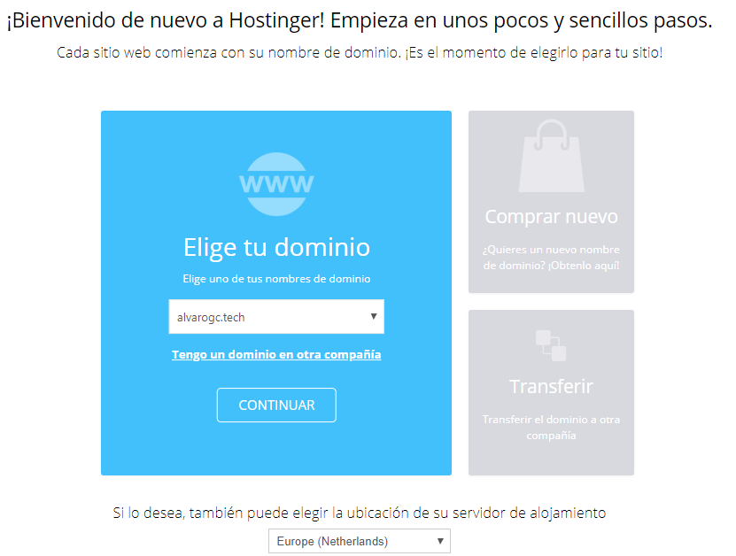
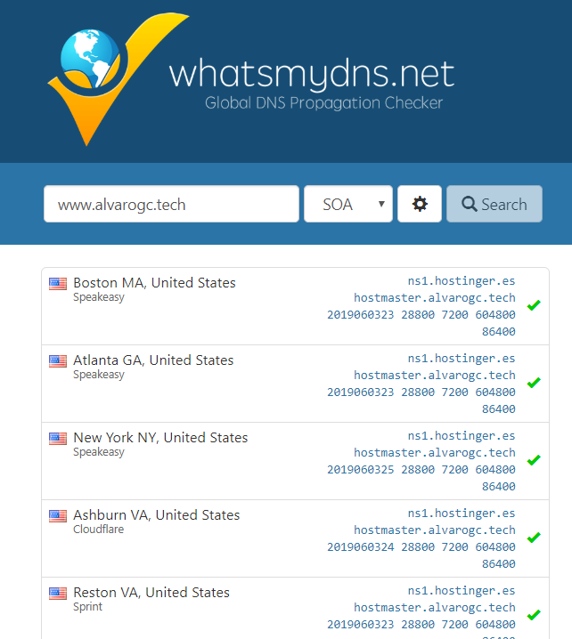
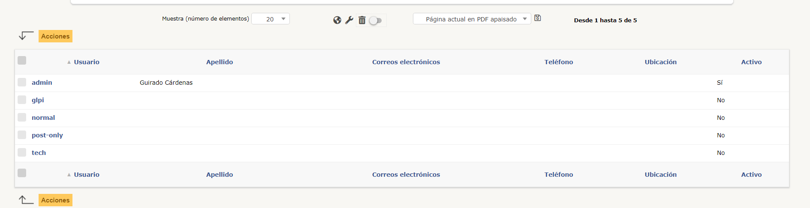

# ¿Qué es AWS?
> Amazon Web Services o por sus siglas **AWS** es la plataforma en la nube líder en
el mundo usada por todo tipo de clientes, desde empresas grandes a personas que desean
probarlo usando sus numerosos servicios gratuitos en los que como veremos a lo largo de
este documento usaremos para instanciar nuestro servidor web en la nube.

## Instancias EC2
> En este proyecto usaremos una de las muchas posibilidades que nos ofrece
Amazon y se trata de **'Amazon Elastic Compute Cloud'** (Amazon EC2) con la que
crearemos una instancia gratuita (si no rebasamos los límites de la capa gratuita) con lo
que ahorraremos en costes y en dificultades de implementación.

***

## Creación de instancia EC2
> Tras crear nuestra cuenta en Amazon Web Services, nos dirigiremos a **EC2** y lanzaremos nuestra primera instancia, en nuestro caso será una instancia con Ubuntu 18.04.

>> En primer lugar elegimos el S.O de nuestra instancia.


***
>> A continuación configuramos el grupo de seguridad (configuración de puertos).


***
>> Por último, generaremos una par de claves SSH para posteriormente conectarnos remotamente.


***

## Conexión a la instancia
> Para conectarnos a la instancia previamente debemos de convertir el archivo **.pem** a **.ppk** que es el formato que acepta Putty para establecer la conexión.

>> Para ello usando PuTTy Key Generator cargamos la clave en formato .pem y generamos la clave privada en el formato '.ppk'.


***
>> Finalmente obtendremos la clave en el formato adecuado que guardaremos en un lugar seguro.


!> Es importante guardar en un lugar seguro la clave privada pues si se almacena en un lugar desprotegido la instancia quedará comprometida.
***
## PuTTy
> **PuTTY** es un cliente SSH y Telnet con el que podemos conectarnos a servidores remotos iniciando una sesión en ellos que nos permite ejecutar comandos. El ejemplo más claro es cuando empleamos PuTTY para ejecutar comandos en un servidor VPS y así poder instalar algún programa o configurar alguna parte del servidor.

>> Para conectarnos remotamente a nuestra instancia en primer lugar debemos de cargar en el apartado **'Auth'** de la sección SSH la clave privada.


>> Además, en la sección principal **(Session)**, especificaremos el nombre, el puerto y el protocolo usado.


?> :information_source: En este caso usamos la sintaxis que se especifica en el panel de AWS pero una vez establezcamos una **ip estática** a la instancia podemos conectarnos especificando la dirección IP.
***

## Asignación de ip estática
> Para otorgar una dirección IP a nuestra instancia debemos de seguir una serie de pasos realmente sencillos.

>> En el menú del lateral izquierdo buscamos **'NETWORK & SECURITY'** y clicamos en **'Elastic IPs'**.


***
>> Clicamos en **'Allocate New Address'** lo que generará una dirección nueva que posteriormente podremos asignar a una instancia.


***
>> En el panel donde se sitúan las instancias hacemos click derecho sobre la instancia y **'Associate Address'**.


***
>> Finalmente asignamos la dirección IP pública estática a la instancia deseada.


?> :information_source: Es recomendable dar un nombre a nuestras instancias para diferenciarlas fácilmente ya que como se puede ver en la imagen el nombre de la instancia **(Lista desplegable 'Instance')** es generado aleatoriamente y no es nada intuitivo.
***

## Instalación de apache
> El primer paso para implementar GLPI en nuestra instancia es instalar el servidor web **Apache**. Para ello tras conectarnos usando PuTTy como vimos anteriormente ejecutamos desde la línea de comandos.
```bash
sudo apt-get install apache2
```
***
>> Tras esto, comprobamos que apache funciona correctamente y además verificamos que la IP estática asignada anteriormente es correcta.


***

## Alquiler de dominio y alojamiento web
> Antes de poner en marcha nuestro servicio en la web necesitamos un hosting web donde se aloje nuestro sitio y un dominio desde el que podrá realizarse la búsqueda de nuestro servicio. En esta ocasión el hosting web elegido es **Hostinger**.

>> Tras crear nuestra cuenta en Hostinger el primer paso será alquilar un dominio. Para ello buscamos el nombre que queramos y lo alquilamos, los pasos son muy sencillos e intuitivos por lo que no veo necesario mostrar el proceso al completo.
***
>> Posteriormente realizamos el mismo proceso pero esta vez alquilaremos el alojamiento web para nuestro dominio.


***
>> El último paso consistirá en modificar el registro A del dominio (La dirección IP) por la dirección que otorgamos a nuestra instancia de Amazon.


***

## Propagación DNS
> Llegado este momento, debemos de entender el concepto de propagación DNS. Al realizar un cambio en nuestro dominio y confirmar los cambios debemos esperar a que todos los servidores DNS de primer nivel en todo el mundo reconozcan dichos cambios.

>> Para comprobarlo usaremos la página **'whatsmydns'** donde introduciremos el nombre de nuestro dominio para verificar el reconocimiento.


***

## Instalación de certificados SSL
> Para aportar la seguridad necesaria a nuestro sitio web es necesario instalar los certificados SSL los cuales se corresponden con una firma electrónica que acredita que nuestro sitio web es fiable.

>> En este caso usaremos **Certbot** que se trata de una herramienta de la C.A (Autoridad Certificadora) Let's Encrypt que permite a cualquier persona obtener un certificado TLS/SSL para incorporar a nuestro sitio web el protocolo HTTPS de una forma muy sencilla y gratuita.

>> El primer paso será conectarnos a nuestra instancia usando PuTTy donde ejecutaremos los siguientes comandos:

* Añadimos el repositorio de Certbot

```bash
sudo apt-get update

sudo apt-get install software-properties-common

sudo add-apt-repository ppa:certbot/certbot

sudo apt-get update
```
***

* Instalamos Certbot en su versión para Apache

```bash
sudo apt-get install python-certbot-apache
```
***

* Finalmente generamos el certificado para nuestro dominio

```bash
sudo certbot --apache -d alvarogc.tech -d www.alvarogc.tech
```
***

> Tras la ejecución de este último comando se generará automáticamente un nuevo fichero de configuración de sitio en Apache.


>> Ahora si accedemos desde el navegador a nuestro sitio deberíamos de observar que efectivamente el certificado es válido.


?> :information_source: Para activar nuestro sitio web en Apache ejecutaremos el comando **'sudo a2ensite <nombre del fichero de configuración del sitio>'** para más información consultar [aquí](http://manpages.ubuntu.com/manpages/bionic/en/man8/a2ensite.8.html).
***

## Instalación de MySQL y GLPI
> Una vez hemos configurado la estructura básica de nuestro sitio el siguiente paso es instalar GLPI y MySQL. 
Empezaremos con MySQL.

### Instalación de MySQL
> Para instalar MySQL simplemente ejecutamos el siguiente comando

```bash
sudo apt install mysql-server
```
!> Con este comando instalaremos la **versión 5.7.26**, si requieres la versión actual **(8.16)** puedes seguir esta [guía](https://www.digitalocean.com/community/tutorials/como-instalar-mysql-en-ubuntu-18-04-es).
***
>> Ahora nos conectamos a mysql y modificamos la autenticación del usuario root para que use el plugin **mysql_native_password** en lugar del por defecto **auth_socket**.

s
***
>> Seguidamente modificamos al usuario

```bash
ALTER USER 'root'@'localhost' IDENTIFIED WITH mysql_native_password BY '<password>';
```
***
>> Finalmente comprobamos los cambios.


!> El plugin **mysql_native_password** es el método tradicional de autenticación en MySQL pero actualmente no es muy seguro pues usa solo un hash de la contraseña, en este caso lo usamos porque es compatible con controladores antiguos y GLPI.
***

### Instalación de PHP
> Instalamos PHP y sus módulos de Apache y MySQL.

```bash
sudo apt install php libapache2-mod-php php-mysql
```
***

### Instalación de GLPI
> A continuación, instalaremos GLPI descargando el paquete directamente desde el repositorio oficial de GitHub, descargamos la última versión estable a día de hoy (Mayo de 2019) la **versión 9.4.2** y la descomprimimos usando el comando **tar**.

```bash
sudo wget https://github.com/glpi-project/glpi/releases/download/9.4.2/glpi-9.4.2.tgz

tar -xvzf glpi-9.4.2.tgz
```
***
>> Ahora movemos el contenido del directorio **'glpi'** a la ruta de nuestro sitio web.

```bash
mv glpi/* /var/www/html/*
```

***
>> Es momento de acceder a nuestro entorno web y si todo ha ido bien veremos algo similar a esto:


***
>> Continuamos y encontraremos los siguientes errores y advertencias.


***

## Resolución de incidencias
>> Para resolver las incidencias lo primero será cambiar los permisos a los directorios **'files'** y **'config'**.

```bash
...:/var/www/html$ sudo chmod -R 777 files/
...:/var/www/html$ sudo chmod -R 777 config/
```
***

>> Seguidamente, instalamos las extensiones faltantes.

```bash
sudo apt-get install php7.2-ldap php7.2-imap php7.2-curl php7.2-mbstring php7.2-gd php7.2-xmlrpc php7.2-xsl php7.2-apcu php-cas
```
***

>> Tras instalarlas editamos el fichero **php.ini** (/etc/php/7.2/apache2/php.ini), para habilitar las extensiones requeridas descomentamos las líneas **(eliminamos ';')**.


***

>> Finalmente, volveremos a entrar en nuestro navegador y probamos a instalar de nuevo.


?> :information_source: Es importante reiniciar el servicio de apache siempre que realicemos alguna modificación. **'sudo service apache2 restart'**.
***

## Continuación de la instalación
> Una vez GLPI detecta que las dependencias previas están correctamente instaladas continuamos con la instalación.

>> En primer lugar configuramos la **conexión** de GLPI a la base de datos de MySQL.

***

>> Creamos una base de datos nueva para almacenar los datos.

***

>> Tras la instalación realizaremos las modificaciones indicadas en la advertencia.

***

>> Creamos un nuevo usuario con el rol de **'Super-Admin'**.

***

>> A continuación desactivamos a los usuarios por defecto por motivos de seguridad.

***

>> Finalmente eliminamos el fichero php que realiza la instalación de GLPI para evitar que 'machaquen' la instalación que ya ha sido realizada.
```bash
...:/var/www/html$ sudo rm install/install.php
```
***

## Instalación de Plugins
> El siguiente paso consiste en la instalación de Plugins para ello descargamos los paquetes de los mismos.
```bash
sudo wget https://github.com/pluginsGLPI/genericobject/releases/download/2.7.0/glpi-genericobject-2.7.0.tar.bz2
sudo wget https://sourceforge.net/projects/glpithemes/files/9.4.2/Plugin_Modifications_1.3.2_GLPI_9.4.2.zip
sudo wget https://github.com/fusioninventory/fusioninventory-for-glpi/releases/download/glpi9.4%2B1.1/fusioninventory-9.4+1.1.tar.bz2
```

***

>> Descomprimimos los archivos y los movemos al directorio plugins.

***

>> Eliminamos los paquetes una vez no son necesarios.

***

>> El último paso será instalar GLPI en el apartado **'Configuración -> Complementos'**.

***

## Reglas de entrada a la instancia
> Para terminar añadiremos una medida de seguridad que consiste en filtrar por direcciones IP para controlar desde que localización se accederá a la página para acceder al panel nos situamos en el panel lateral izquierdo y clicamos en la sección **'NETWORK & SECURITY -> Security Groups'**.

>> En este caso, añadiremos reglas para la dirección IP pública de casa y la dirección IP pública del instituto.


?> :information_source: Notar que en la imagen se ha habilitado el acceso por SSH sólamente desde la red de casa para lograr una mayor seguridad.
***

## Posible futura mejora
> Para realizarla podría usarse **Lightsail** en lugar de una instancia EC2 ya que Lightsail soporta el manejo de contenedores Docker de una forma bastante sencilla y quizás usar **Route 53** como proveedor de Hosting para depender totalmente de Amazon y tener todo más centralizado.
