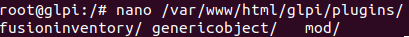
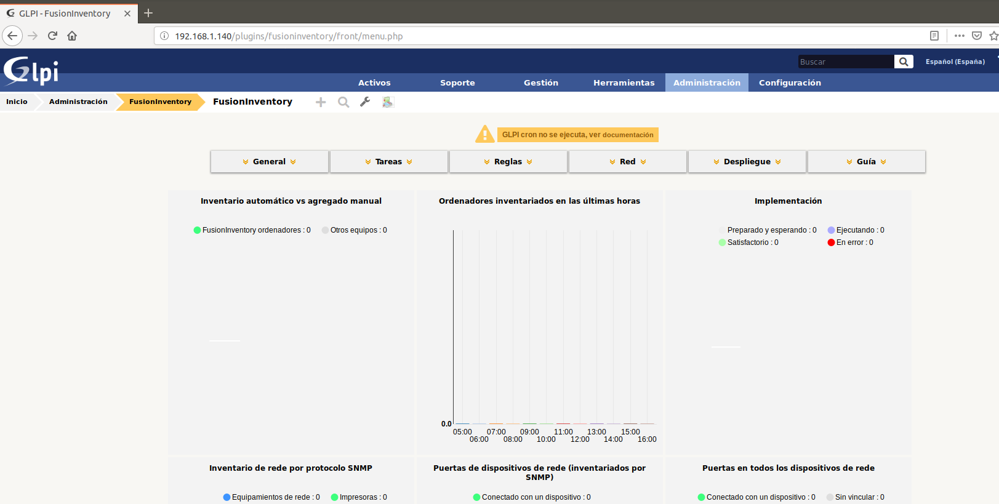
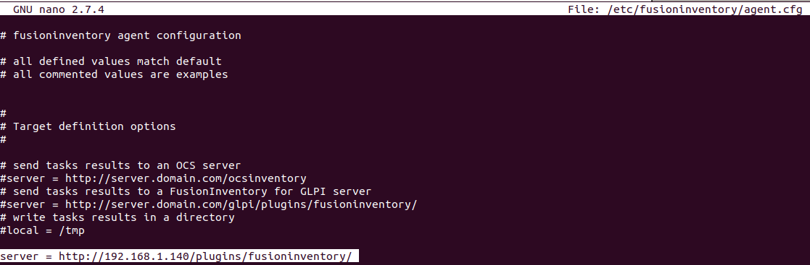
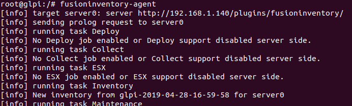
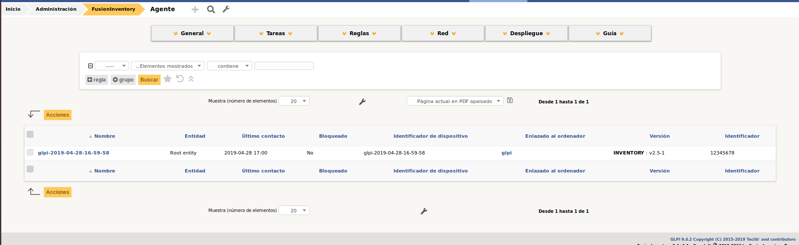

# ¿Qué es GLPI?
> GLPI es un software que nos permite gestionar toda la infraestructura o el área tecnológica de una organización, la principal funcionalidad de este software es facilitar al administrador la gestión de todos los elementos que componen la red en cuanto al inventario (equipos, monitores, software con licencia, estado de hardware, etc…), gestión de problemas, estadísticas por perfiles de usuarios y muchas más opciones de auditoría.

!> Esta implementación fué la inicial y omito muchas configuraciones que serían propias en un entorno de producción como por ejemplo, dominio propio, alojamiento web, HTTPS...

## Instalación usando Docker y Docker-Compose

> Para esta primera implementación de GLPI, el entorno usado en este caso consiste en un mínimo de dos máquinas virtuales **Ubuntu 18.04** donde una sería la que arrancara los contenedores y el resto de máquinas las que pudieran acceder a ella y a la vez enviaran la información de su equipo ejecutando un agente de inventario llamado "Fusioninventory".

### docker-compose.yml

```docker-compose.yml
version: "3.4"

services:
#Contenedor MySQL
  mysql:
    network_mode: "host"
    image: mysql:latest
    container_name: mysql_asir
    hostname: mysql
    ports:
      - "3307:3306"
    command: --default-authentication-plugin=mysql_native_password
    volumes:
      - /home/dockerglpi/glpi_proyecto/var/lib/mysql:/var/lib/mysql
    env_file:
      - ./mysql.env
    restart: always

#Contenedor GLPI
  glpi:
    network_mode: "host"
    image: diouxx/glpi
    container_name: glpi_asir
    hostname: glpi
    ports:
      - "3000:80"
    volumes:
      - /home/dockerglpi/glpi_proyecto/var/www/html/glpi:/var/www/html/glpi
    environment:
      - TIMEZONE=Europe/Madrid
    restart: always
```
***

> GLPI contiene en uno de sus ficheros php la configuración de la conexión a la base de datos, esto no sería un problema si no fuera porque en este caso la dirección IP va a cambiar continuamente de manera que he decidido crear un script que obtenga la dirección actual de la máquina y la modifique por la que tenga en el fichero de configuración de la conexión.

### modIP.sh

```modIP.sh
#!/bin/bash

# Tomamos la ip actual de la maquina virtual #

ip=`ifconfig enp0s3 | grep -w  inet | tr -s " " | cut -d " " -f3`

# Actualizamos la ip a la que apunta GLPI por la ip que tenga en ese momento la maquina virtual #

sed -i -e 's/[0-9]\{1,3\}\.[0-9]\{1,3\}\.[0-9]\{1,3\}\.[0-9]\{1,3\}/'$ip'/g' /var/www/html/glpi/config/config_db.php

exit
```

?> Podríamos generalizar el script para que mediante dos parámetros de entrada indique el usuario la interfaz de red y el fichero de destino

> Para que el script se ejecute cada vez que el equipo se inicie añadiremos una tarea al cron de la máquina usando la variable de sistema **"@reboot"**.

```crontab
@reboot docker exec glpi_asir sh modIP.sh
``` 
***


## ¿Qué es Fusioninventory?

> Fusioninventory es un software libre que es capaz de recopilar información de inventario tanto de hardware como de software en una red determinada y se encargará de recopilar la información de los equipos en la demostración.

### Instalación como plugin de GLPI

> Para instalar cualquier tipo de plugin en GLPI debemos de descargar el paquete y descomprimirlo sobre el directorio **'/plugins'**, debemos de tener en cuenta la compatibilidad de versiones.

?> :information_source: Este paso es muy sencillo si seguimos la guía paso a paso que ofrece la empresa desde su página ([Instalación plugin fusioninventory](http://fusioninventory.org/documentation/fi4g/installation.html)) para que finalmente el árbol de directorios se asemeje al siguiente:



> Una vez instalado nos dirigiremos a la sección de fusioninventory donde serán visibles las estadísticas tras realizar el inventariado con el agente.




***

### Instalación del agente

> Para la instalación del agente (En sistemas Linux), al igual que con el plugin, debemos de descargar los paquetes previamente a su instalación. Para sistemas Windows simplemente debemos de descargar el instalador.

?> :information_source: El agente descargado en este caso se corresponde con la última versión actual (v2.5) que puede ser descargada desde su repositorio [Instalación agente fusioninventory](https://github.com/fusioninventory/fusioninventory-agent/releases/tag/2.5)

> Con vistas al futuro despliegue del agente usando Ansible usaremos un script que se ejecutará en los hosts remotos cuya tarea será la instalación del agente.

```fusion_install.sh
#!/bin/bash

# Obtenemos los paquetes del agente

wget http://debian.fusioninventory.org/downloads/fusioninventory-agent_2.5-3_all.deb
wget http://debian.fusioninventory.org/downloads/fusioninventory-agent-task-collect_2.5-3_all.deb
wget http://debian.fusioninventory.org/downloads/fusioninventory-agent-task-deploy_2.5-3_all.deb
wget http://debian.fusioninventory.org/downloads/fusioninventory-agent-task-esx_2.5-3_all.deb
wget http://debian.fusioninventory.org/downloads/fusioninventory-agent-task-network_2.5-3_all.deb

# Instalamos las dependencias de los paquetes

apt -y install libnet-snmp-perl libcrypt-des-perl libnet-nbname-perl
apt -y install libfile-copy-recursive-perl libparallel-forkmanager-perl
apt -y install libwrite-net-perl


# Finalmente, instalamos los paquetes

dpkg -i fusioninventory-agent_2.5-3_all.deb
dpkg -i fusioninventory-agent-task-collect_2.5-3_all.deb
dpkg -i fusioninventory-agent-task-network_2.5-3_all.deb
dpkg -i fusioninventory-agent-task-deploy_2.5-3_all.deb
dpkg -i fusioninventory-agent-task-esx_2.5-3_all.deb

# En caso de error, se ejecutará el comando siguiente

apt -y --fix-broken install

sudo systemctl restart fusioninventory-agent
```

#### Configuración básica del agente

> Para configurar el agente debemos de añadir una línea al archivo de configuración, esta línea será la que procesará el agente a la hora de enviar la información del inventario realizado a GLPI



!> Recuerdo que en este caso apuntamos a la dirección IP de la máquina que está ejecutando el contenedor de GLPI, más adelante cambiaremos esta línea para que envíe la información a nuestra instancia AWS.

#### Ejecución del agente

> Para ejecutar el agente de forma manual desde la línea de comandos ejecutamos el siguiente comando.



?> :information_source: Más adelante veremos una forma simplificada y útil cuando debamos ejecutar el agente sin necesidad de modificar el archivo de configuración programando un tarea en cron con Ansible en los hosts remotos.

> Tras su ejecución en GLPI veríamos al equipo recién inventariado.




